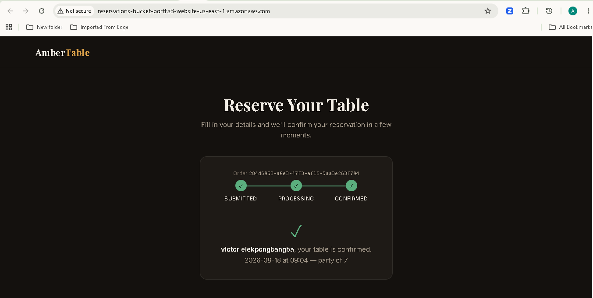
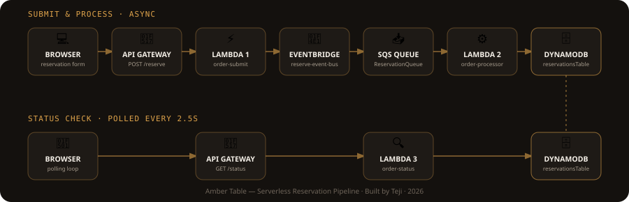
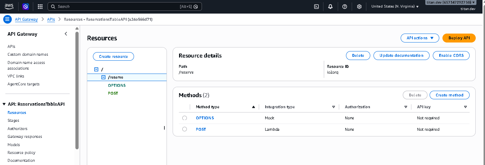
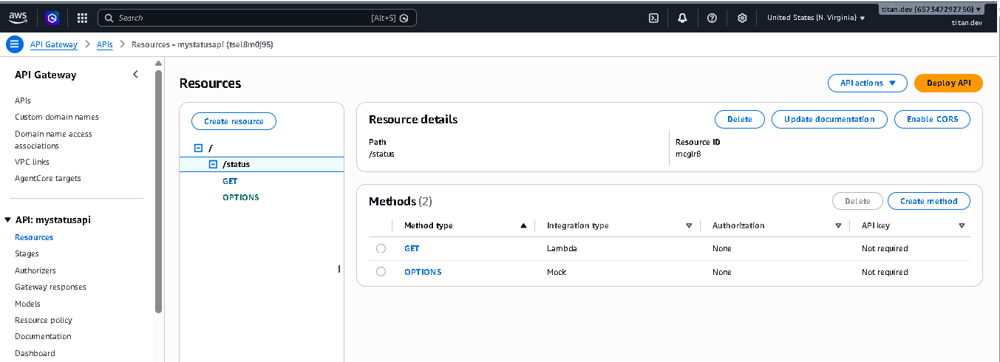
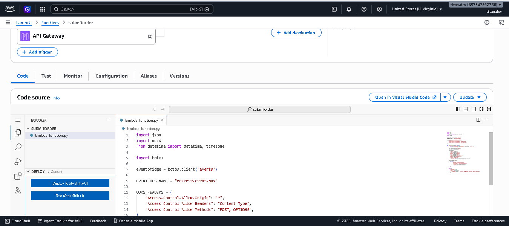
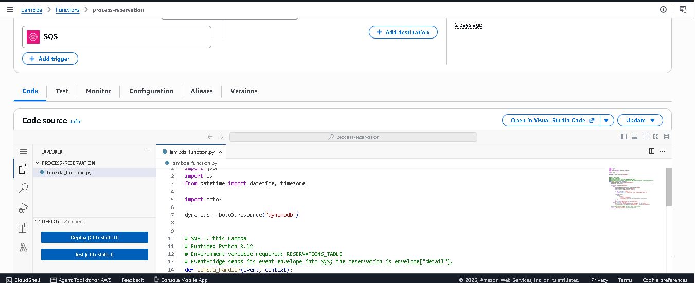
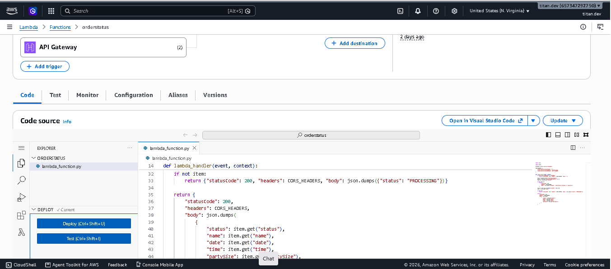
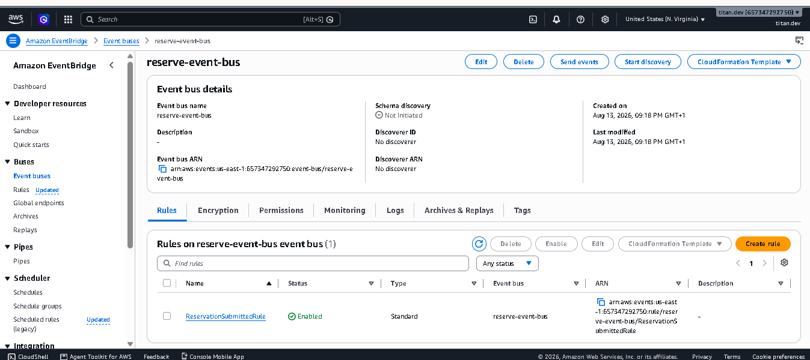
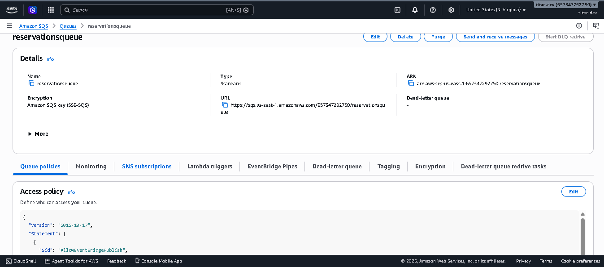
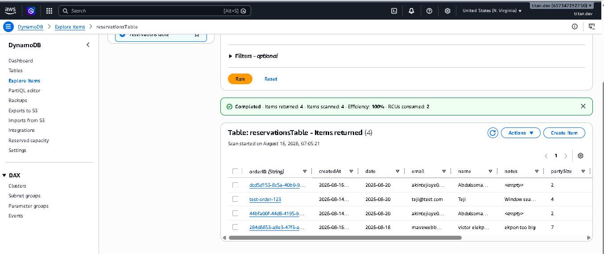

# 🍽️ Amber Table — Serverless Reservation System

An event-driven table reservation app built entirely on AWS serverless services. Submitting a reservation and finding out it's confirmed are two separate, decoupled paths — connected by EventBridge, SQS, and a polling status check.

---

## 🌐 Live Demo



---

## 🏗️ Architecture



### Path 1 — Submit & Process (async)

1. User fills out the reservation form and submits
2. `POST /reserve` hits **API Gateway** → **Lambda 1 (`order-submit`)**
3. Lambda 1 generates an `orderID`, builds the reservation record, and publishes it to **EventBridge** on the custom `reserve-event-bus`
4. Lambda 1 returns `{ orderID, status: "SUBMITTED" }` to the browser immediately — this request-response cycle ends here
5. An **EventBridge rule** matches the event and routes it to an **SQS queue**
6. SQS triggers **Lambda 2 (`order-processor`)** via an event source mapping
7. Lambda 2 writes the reservation to **DynamoDB** with `status: "PROCESSED"`. Failed records are reported individually via `batchItemFailures`, so only the failed message retries — not the whole batch

### Path 2 — Status Check (polled)

Lambda 2 can't push a response back to the original HTTP call — that connection already closed in step 4. So the frontend asks instead:

1. After submitting, the browser polls every 2.5 seconds
2. `GET /status?orderID=...` hits a second **API Gateway** → **Lambda 3 (`order-status`)**
3. Lambda 3 reads DynamoDB by `orderID`
4. Not found yet → returns `PROCESSING` (still moving through the pipeline)
5. Found → returns `PROCESSED` plus the reservation details
6. Browser stops polling and shows the confirmation

---

## 🛠️ AWS Services Used

| Service | Role |
|---|---|
| S3 | Hosts the static frontend website |
| API Gateway (Submit) | `POST /reserve` — receives new reservations |
| API Gateway (Status) | `GET /status` — polled for order status |
| Lambda — `order-submit` | Generates the orderID, publishes the event to EventBridge |
| EventBridge | Custom event bus (`reserve-event-bus`) routing submitted reservations to SQS |
| SQS | Buffers reservation events between submission and processing |
| Lambda — `order-processor` | Consumes the queue, writes the reservation to DynamoDB |
| Lambda — `order-status` | Reads DynamoDB, reports status back to the frontend |
| DynamoDB | Stores every reservation record (`reservationsTable`) |
| IAM | Execution role per Lambda, scoped to the services it touches |
| CloudWatch | Logs for each Lambda, used to debug the pipeline |

---

## 📸 Screenshots

### Live Website


### API Gateway — Submit


### API Gateway — Status


### Lambda 1 — order-submit


### Lambda 2 — order-processor


### Lambda 3 — order-status


### EventBridge Rule


### SQS Queue


### DynamoDB Table


---

## 📂 Project Structure

```
amber-table-reservations/
├── index.html
├── lambda/
│   ├── order-submit.py
│   ├── order-processor.py
│   └── order-status.py
├── architecture.svg
├── README.md
└── screenshots/
    ├── reservation-liveweb.png
    ├── reservation-submit-api.png
    ├── reservation-status-api.png
    ├── reservation-lambda1.png
    ├── reservation-lambda2.png
    ├── reservation-lambda3.png
    ├── reservation-eventbridge.png
    ├── reservation-sqs.png
    └── reservation-dynamodb.png
```

---

## 🧠 Key Concepts Learned

- **Event-driven architecture** — EventBridge decouples "something happened" from "who needs to know," so the submit path has no idea SQS or Lambda 2 even exist
- **SQS as a buffer** between an event producer and a slower/asynchronous consumer
- **Partial batch failure handling** — `batchItemFailures` lets one bad record retry without replaying an entire successful batch
- **Why async backends can't respond to the original request** — solved here with a polling status-check endpoint instead of holding the connection open
- **Custom event bus rule ARNs** differ from default-bus rule ARNs (`rule/bus-name/rule-name`, not `rule/rule-name`) — get this wrong and EventBridge fails to deliver with no obvious error
- **SQS resource policies** — EventBridge needs explicit `sqs:SendMessage` permission on the queue before it can deliver anything
- **Consistent key casing** (`orderID`) across every Lambda and the frontend — a mismatch here fails silently rather than throwing an error

---

## ⚙️ Lambda Functions

### Lambda 1 — order-submit

```python
import json
import uuid
from datetime import datetime, timezone

import boto3

eventbridge = boto3.client("events")

EVENT_BUS_NAME = "reserve-event-bus"

CORS_HEADERS = {
    "Access-Control-Allow-Origin": "*",
    "Access-Control-Allow-Headers": "Content-Type",
    "Access-Control-Allow-Methods": "POST, OPTIONS",
}


def lambda_handler(event, context):
    if event.get("httpMethod") == "OPTIONS":
        return {"statusCode": 200, "headers": CORS_HEADERS, "body": ""}

    body = json.loads(event["body"])
    order_id = str(uuid.uuid4())

    reservation = {
        "orderID": order_id,
        "name": body.get("name"),
        "email": body.get("email"),
        "phone": body.get("phone"),
        "date": body.get("date"),
        "time": body.get("time"),
        "partySize": body.get("partySize"),
        "notes": body.get("notes", ""),
        "status": "SUBMITTED",
        "createdAt": datetime.now(timezone.utc).isoformat(),
    }

    eventbridge.put_events(
        Entries=[
            {
                "Source": "reservations.app",
                "DetailType": "ReservationSubmitted",
                "Detail": json.dumps(reservation),
                "EventBusName": EVENT_BUS_NAME,
            }
        ]
    )

    return {
        "statusCode": 200,
        "headers": CORS_HEADERS,
        "body": json.dumps(
            {"orderID": order_id, "status": "SUBMITTED", "message": "Order submitted"}
        ),
    }
```

### Lambda 2 — order-processor

```python
import json
from datetime import datetime, timezone

import boto3

dynamodb = boto3.resource("dynamodb")


def lambda_handler(event, context):
    table = dynamodb.Table("reservationsTable")
    batch_item_failures = []

    for record in event["Records"]:
        try:
            eventbridge_envelope = json.loads(record["body"])
            order = eventbridge_envelope["detail"]

            if not order.get("orderID"):
                raise ValueError("Reservation event is missing orderID.")

            table.put_item(
                Item={
                    **order,
                    "status": "PROCESSED",
                    "processedAt": datetime.now(timezone.utc).isoformat(),
                }
            )
            print(f"Order processed: {order['orderID']}")
        except Exception as error:
            print(f"Failed SQS message {record['messageId']}: {error}")
            batch_item_failures.append({"itemIdentifier": record["messageId"]})

    return {"batchItemFailures": batch_item_failures}
```

### Lambda 3 — order-status

```python
import json

import boto3

dynamodb = boto3.resource("dynamodb")

CORS_HEADERS = {
    "Access-Control-Allow-Origin": "*",
    "Access-Control-Allow-Headers": "Content-Type",
    "Access-Control-Allow-Methods": "GET, OPTIONS",
}


def lambda_handler(event, context):
    if event.get("httpMethod") == "OPTIONS":
        return {"statusCode": 200, "headers": CORS_HEADERS, "body": ""}

    table = dynamodb.Table("reservationsTable")
    params = event.get("queryStringParameters") or {}
    order_id = params.get("orderID")

    if not order_id:
        return {
            "statusCode": 400,
            "headers": CORS_HEADERS,
            "body": json.dumps({"message": "orderID query parameter is required"}),
        }

    result = table.get_item(Key={"orderID": order_id})
    item = result.get("Item")

    if not item:
        return {"statusCode": 200, "headers": CORS_HEADERS, "body": json.dumps({"status": "PROCESSING"})}

    return {
        "statusCode": 200,
        "headers": CORS_HEADERS,
        "body": json.dumps(
            {
                "status": item.get("status"),
                "name": item.get("name"),
                "date": item.get("date"),
                "time": item.get("time"),
                "partySize": item.get("partySize"),
            }
        ),
    }
```

---

## 🚀 How to Deploy

1. **DynamoDB** — create `reservationsTable`, partition key `orderID` (String)
2. **EventBridge** — create a custom event bus named `reserve-event-bus`
3. **SQS** — create `ReservationQueue`, attach a resource policy allowing `events.amazonaws.com` to `sqs:SendMessage`, scoped to the EventBridge rule's ARN
4. **Lambda 1** (`order-submit`) — deploy, attach `AmazonEventBridgeFullAccess`
5. **EventBridge rule** — on `reserve-event-bus`, pattern matching `source: reservations.app`, `detail-type: ReservationSubmitted`, target: `ReservationQueue`
6. **Lambda 2** (`order-processor`) — deploy, attach `AmazonSQSFullAccess` + `AmazonDynamoDBFullAccess`, add an SQS trigger on `ReservationQueue` with **Report batch item failures** enabled
7. **Lambda 3** (`order-status`) — deploy, attach `AmazonDynamoDBFullAccess`
8. **API Gateway** — one API with `POST /reserve` → Lambda 1, another (or same API, second resource) with `GET /status` → Lambda 3
9. **S3** — upload `index.html`, enable static website hosting
10. Paste both API invoke URLs into `index.html`, re-upload

---

## 👤 Author

**Teji** — Aspiring Cloud Engineer.
Building on AWS · Learning in public · 2026
